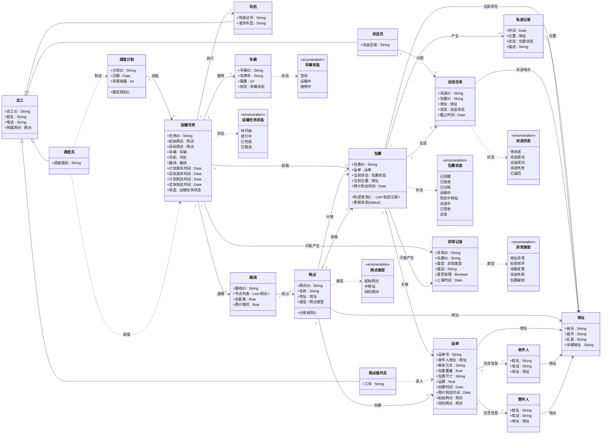

```mermaid
classDiagram
direction LR

%% ========= 值对象：地址 =========
class 地址 {
    +省份 : String
    +城市 : String
    +区县 : String
    +详细地址 : String
}

%% ========= 核心实体 =========
class 包裹 {
    +包裹ID : String
    +运单 : 运单
    +当前状态 : 包裹状态
    +当前位置 : 地址
    +预计到达时间 : Date
    +轨迹查询() : List~轨迹记录~
    +更新状态(status)
}

class 运单 {
    +运单号 : String
    +收件人地址 : 地址
    +联系方式 : String
    +包裹重量 : float
    +包裹尺寸 : String
    +运费 : float
    +创建时间 : Date
    +预计到达时间 : Date
    +起始网点 : 网点
    +目的网点 : 网点
}

class 轨迹记录 {
    +时间 : Date
    +位置 : 地址
    +状态 : 包裹状态
    +描述 : String
}

class 寄件人 {
    +姓名 : String
    +电话 : String
    +地址 : 地址
}

class 收件人 {
    +姓名 : String
    +电话 : String
    +地址 : 地址
}

%% ========= 角色 =========
class 员工 {
    +员工ID : String
    +姓名 : String
    +电话 : String
    +所属网点 : 网点
}

class 司机 {
    +驾驶证号 : String
    +准驾车型 : String
}

class 派送员 {
    +派送区域 : String
}

class 调度员 {
    +调度级别 : String
}

class 网点操作员 {
    +工号 : String
}

%% 继承关系
员工 <|-- 司机
员工 <|-- 派送员
员工 <|-- 调度员
员工 <|-- 网点操作员

%% ========= 运输与分拣 =========
class 网点 {
    +网点ID : String
    +名称 : String
    +地址 : 地址
    +类型 : 网点类型
    +分拣规则()
}

class 路线 {
    +路线ID : String
    +节点列表 : List~网点~
    +总距离 : float
    +预计耗时 : float
}

class 运输任务 {
    +任务ID : String
    +起始网点 : 网点
    +目标网点 : 网点
    +车辆 : 车辆
    +司机 : 司机
    +路线 : 路线
    +计划发车时间 : Date
    +实际发车时间 : Date
    +计划到达时间 : Date
    +实际到达时间 : Date
    +状态 : 运输任务状态
}

class 调度计划 {
    +计划ID : String
    +日期 : Date
    +车辆容量 : int
    +路径规划()
}

class 车辆 {
    +车辆ID : String
    +车牌号 : String
    +载重 : int
    +状态 : 车辆状态
}

%% ========= 派送 =========
class 派送任务 {
    +派送ID : String
    +包裹ID : String
    +地址 : 地址
    +状态 : 派送状态
    +截止时间 : Date
}

%% ========= 异常处理 =========
class 异常记录 {
    +异常ID : String
    +包裹ID : String
    +类型 : 异常类型
    +描述 : String
    +是否处理 : Boolean
    +上报时间 : Date
}

%% ========= 枚举类 =========
class 包裹状态 {
    <<enumeration>>
    已创建
    已揽收
    已分拣
    运输中
    到达中转站
    派送中
    已签收
    异常
}

class 运输任务状态 {
    <<enumeration>>
    待开始
    进行中
    已完成
    已取消
}

class 派送状态 {
    <<enumeration>>
    待派送
    派送尝试
    派送成功
    派送失败
    已退回
}

class 异常类型 {
    <<enumeration>>
    地址异常
    标签损坏
    线路变更
    派送失败
    包裹破损
}

class 网点类型 {
    <<enumeration>>
    起始网点
    中转站
    目的网点
}

class 车辆状态 {
    <<enumeration>>
    空闲
    运输中
    维修中
}

%% ========= 实体关系=========

%% ========== 客户寄件流程 ==========

%% 寄件人在网点发起寄件
网点 "1" --> "1..*" 运单 : 创建
网点操作员 ..> 运单 : 录入

%% 包裹由网点揽收
网点 "1" --> "1..*" 包裹 : 揽收

%% 运单与收件人、寄件人
运单 "1" --> "1" 收件人 : 包含信息
运单 "1" --> "1" 寄件人 : 包含信息

%% 每个包裹关联一个运单
包裹 "1" --> "1" 运单 : 关联

%% ========== 分拣与运输 ==========

%% 网点为包裹分拣
网点 "1" --> "1..*" 包裹 : 分拣

%% 调度员管理运输任务
调度员 ..> 运输任务 : 调度
调度员 ..> 调度计划 : 制定

%% 运输任务装载多个包裹
运输任务 "1" --> "1..*" 包裹 : 装载

%% 调度计划组织多个运输任务
调度计划 "1" --> "1..*" 运输任务 : 调度

%% 运输任务关联车辆与司机
运输任务 "1" --> "1" 车辆 : 使用
运输任务 "1" --> "1" 司机 : 执行
运输任务 "1" --> "1" 路线 : 遵循

%% 路线经过网点
路线 "1" --> "2..*" 网点 : 经过

%% ========== 派送任务 ==========

包裹 "1" --> "1" 派送任务 : 生成
派送员 "1" --> "1..*" 派送任务 : 分配

%% ========== 包裹轨迹与异常 ==========

包裹 "1" --> "1..*" 轨迹记录 : 产生
包裹 "1" --> "*" 异常记录 : 可能产生
运输任务 "1" --> "*" 异常记录 : 可能产生

%% ========= 值对象关联 =========
寄件人 --> 地址 : 地址
收件人 --> 地址 : 地址
运单 --> 地址 : 地址
网点 --> 地址 : 地址
派送任务 --> 地址 : 派送地点
轨迹记录 --> 地址 : 位置
包裹 --> 地址 : 当前所在

%% ========= 枚举使用 =========
包裹 ..> 包裹状态 : 状态
运输任务 ..> 运输任务状态 : 状态
派送任务 ..> 派送状态 : 状态
异常记录 ..> 异常类型 : 类型
网点 ..> 网点类型 : 类型
车辆 ..> 车辆状态 : 状态
```