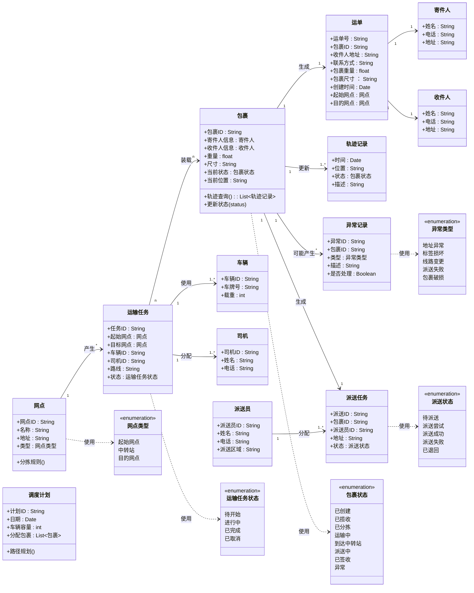

```mermaid
classDiagram
direction LR

%% ========= 核心实体 =========
class 包裹 {
    +包裹ID : String
    +寄件人信息 : 寄件人
    +收件人信息 : 收件人
    +重量 : float
    +尺寸 : String
    +当前状态 : 包裹状态
    +当前位置 : String
    +轨迹查询() : List~轨迹记录~
    +更新状态(status)
}

class 运单 {
    +运单号 : String
    +包裹ID : String
    +收件人地址 : String
    +联系方式 : String
    +包裹重量 : float
    +包裹尺寸 ： String
    +创建时间 : Date
    +起始网点 : 网点
    +目的网点 : 网点
}

class 轨迹记录 {
    +时间 : Date
    +位置 : String
    +状态 : 包裹状态
    +描述 : String
}

class 寄件人 {
    +姓名 : String
    +电话 : String
    +地址 : String
}

class 收件人 {
    +姓名 : String
    +电话 : String
    +地址 : String
}

%% ========= 运输与分拣 =========
class 网点 {
    +网点ID : String
    +名称 : String
    +地址 : String
    +类型 : 网点类型
    +分拣规则()
}

class 运输任务 {
    +任务ID : String
    +起始网点 : 网点
    +目标网点 : 网点
    +车辆ID : String
    +司机ID : String
    +路线 : String
    +状态 : 运输任务状态
}

class 调度计划 {
    +计划ID : String
    +日期 : Date
    +车辆容量 : int
    +分配包裹 : List~包裹~
    +路径规划()
}

class 车辆 {
    +车辆ID : String
    +车牌号 : String
    +载重 : int
}

class 司机 {
    +司机ID : String
    +姓名 : String
    +电话 : String
}

%% ========= 派送 =========
class 派送任务 {
    +派送ID : String
    +包裹ID : String
    +派送员ID : String
    +地址 : String
    +状态 : 派送状态
}

class 派送员 {
    +派送员ID : String
    +姓名 : String
    +电话 : String
    +派送区域 : String
}

%% ========= 异常处理 =========
class 异常记录 {
    +异常ID : String
    +包裹ID : String
    +类型 : 异常类型
    +描述 : String
    +是否处理 : Boolean
}

%% ========= 枚举（中文） =========
class 包裹状态 {
    <<enumeration>>
    已创建
    已揽收
    已分拣
    运输中
    到达中转站
    派送中
    已签收
    异常
}

class 运输任务状态 {
    <<enumeration>>
    待开始
    进行中
    已完成
    已取消
}

class 派送状态 {
    <<enumeration>>
    待派送
    派送尝试
    派送成功
    派送失败
    已退回
}

class 异常类型 {
    <<enumeration>>
    地址异常
    标签损坏
    线路变更
    派送失败
    包裹破损
}

class 网点类型 {
    <<enumeration>>
    起始网点
    中转站
    目的网点
}

%% ========= 关系（含基数） =========

%% 包裹与运单 1:1
包裹 "1" --> "1" 运单 : 生成

%% 包裹与轨迹记录 1..* 
包裹 "1" --> "1..*" 轨迹记录 : 更新

%% 包裹与异常记录 *
包裹 "1" --> "*" 异常记录 : 可能产生

%% 包裹与派送任务 1:1
包裹 "1" --> "1" 派送任务 : 生成

%% 运单 1:1 寄件人/收件人
运单 "1" --> "1" 寄件人
运单 "1" --> "1" 收件人

%% 网点与运输任务 *
网点 "1" --> "*" 运输任务 : 产生

%% 运输任务与车辆 1..*
运输任务 "1" --> "1..*" 车辆 : 使用

%% 运输任务与司机 1..*
运输任务 "1" --> "1..*" 司机 : 分配

%% 运输任务与包裹 多对多
运输任务 "n" --> "n" 包裹 : 装载

%% 派送任务 1..* 属于派送员 1
派送员 "1" --> "1..*" 派送任务 : 分配

%% ========= 枚举关联 =========
包裹 ..> 包裹状态 : 使用
运输任务 ..> 运输任务状态 : 使用
派送任务 ..> 派送状态 : 使用
异常记录 ..> 异常类型 : 使用
网点 ..> 网点类型 : 使用
```